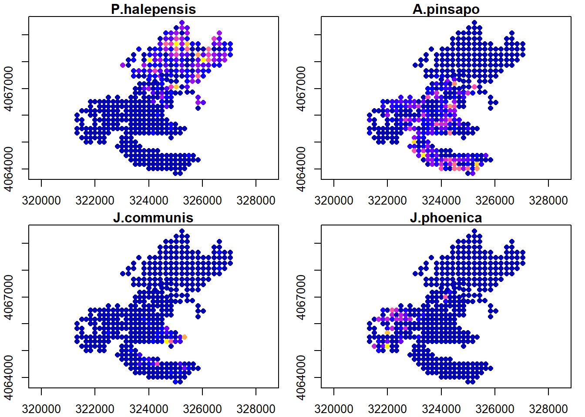
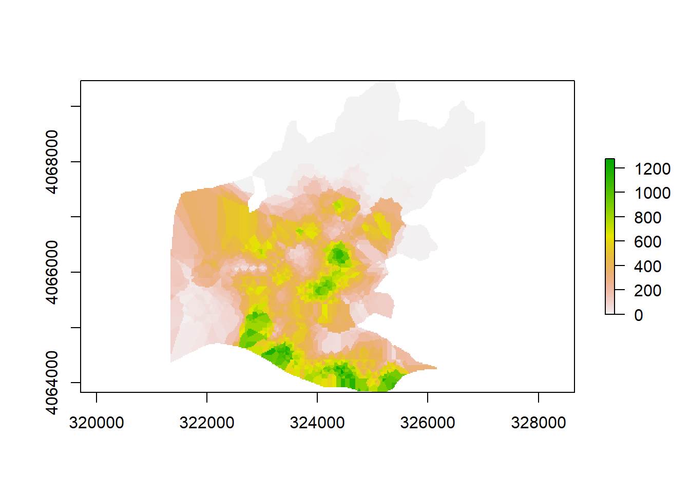
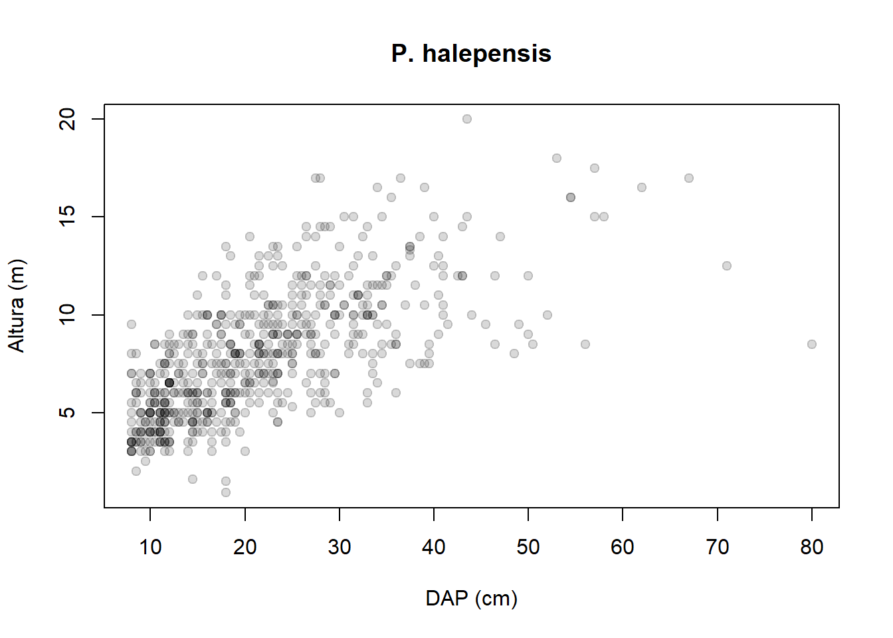
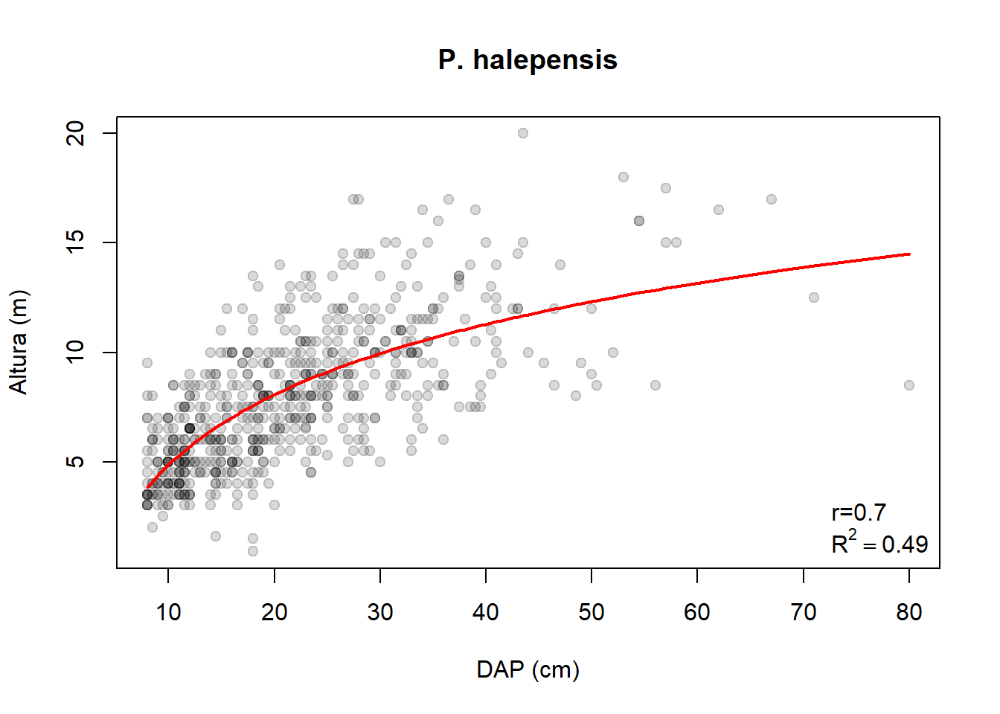

Mª Ángeles Varo Martínez y Rafael Mª Cerrillo Navarro

# Capítulo 19: Análisis de datos de inventarios forestales

## 1. INFORMACIÓN FORESTAL RELATIVA A LAS ORDENACIONES

Se va a trabajar con el monte público Pinar de Yunquera, con código MA-30037-AY. Se trata de un monte de unas 2.000 ha de titularidad pública, perteneciente al Ayuntamiento de Yunquera y cuya gestión ha venido realizando la Consejería de Medio Ambiente de la Junta de Andalucía. Está localizado en el interior del Parque Natural Sierra de las Nieves y contiene una variedad florística de incalculable valor.

La Consejería, con cargo a sus presupuestos, y de acuerdo con los principios marcados por el Plan Forestal Andaluz y la Ley 2/92 Forestal de Andalucía, desarrolla de forma continuada una línea de trabajo de [ordenación de terrenos forestales públicos.](https://www.juntadeandalucia.es/medioambiente/portal/landing-page-%C3%ADndice/-/asset_publisher/zX2ouZa4r1Rf/content/ordenaci-c3-b3n-de-montes-bajo-gesti-c3-b3n-p-c3-bablica-en-la-comunidad-aut-c3-b3noma-de-andaluc-c3-ada/20151?categoryVal=)

Dentro de las acciones encaminadas a la redacción de las ordenaciones de montes públicos, se realizan labores de inventario forestal en los se realiza un muestreo sistemático estratificado. En cada parcela circular, que según la ordenación varía en su radio, pero que en el monte de estudio es de 13 m se recoge información de diámetros normales de los pies y especie a la que pertenecen, altura total de los pies en una selección de árboles tipos y cuantificación y altura de matorral y regeneración en una subparcela de 5 m. Las características del diseño de inventario pueden consultarse en la [documentación referente a la ordenación.](https://portalrediam.cica.es/descargas?path=%2F09_PLANIFICACION%2F03_PLANES_ORD_MONTES%2F01_PROYECTO_ORD%2FPU_110_PO_PinarYunquera_p)

### Cargar de los límites del monte

Primero es necesario establecer un nuevo directorio de trabajo que va a involucrar únicamente a los archivos del presente ejercicio:

```r
#Establecer el directorio de trabajo
setwd("C:/DESCARGA/")
```

Seguidamente, se cargan los límites del monte guardados previamente.

```r
#Establecer el directorio de trabajo
load("Monte.RData")
```

### Análisis del inventario

Para empezar el análisis del inventario, se introducirán las tablas que forman parte del inventario. Deben estar guardadas en la misma carpeta que se ha establecido como directorio de trabajo.

```r
#Activar el paquete para leer tabla de excel
library(readxl)

#Leer tabla de excel, hoja de localizacion de parcelas
Inventario <- read_excel("DATOS_INVENTARIO.xls",sheet=1)

#Leer tabla de excel, hoja de datos dasométricos
Pies.mayores<-read_excel("DATOS_INVENTARIO.xls",sheet=3)

#Leer tabla de excel, hojas de datos dasométricos
Arboles.tipo<-read_excel("DATOS_INVENTARIO.xls",sheet=2)

#Leer tabla de excel, hojas de regeneración
Regeneracion<-read_excel("DATOS_INVENTARIO.xls",sheet=4)

#Leer tabla de excel, hojas de matorral
Matorral<-read_excel("DATOS_INVENTARIO.xls",sheet=5)
```

Seguidamente, se convierte la matriz en un data frame para poder trabajar mejor con ella en R.

```r
#Convertir la tabla en un data frame
Inventario<-as.data.frame(Inventario)
Arboles.tipo<-as.data.frame(Arboles.tipo)
Pies.mayores<-as.data.frame(Pies.mayores)
Regeneracion<-as.data.frame(Regeneracion)
Matorral<-as.data.frame(Matorral)
```

Se comienza analizando las coordenadas del inventario. Se puede visualizar la tabla.

```r
#Ver la tabla de datos
View(Inventario)
```

Se puede comprobar cómo algunas de las ubicaciones señaladas en el diseño de inventario resultaron innaccesibles. Por eso, no se rellenaron sus datos de coordenadas X e Y. Las eliminaremos, puesto que no contienen información efectiva.

Además se seleccionan los campos que van a resultar útiles para el estudio de la vegetación.

```r
#Activación de la librería necesaria
library(sf)

#Convertir data frame a SpatialPointsDataFrame
Inventario.sp <- st_as_sf(x=Inventario,coords=c("X","Y"), crs=23030)

#Representación cartográfica de las parcelas
library(mapview)

mapview(Inventario.sp,map.type = "Esri.WorldImagery")
```


## 2. EXTRACCIÓN DE LA INFORMACIÓN DEL INVENTARIO

### 1. Destribución de la densidad de especies

Ahora se va a analizar la distribución de las especies principales del monte. Pero primero, es necesario determinar cuáles son éstas.

```r
#Nombres de las columnas de la tabla de pies mayores
colnames(Pies.mayores)
```

```r annotate
## [1] "CÓDIGO MONTE SENDAS" "Nº PARCELA"          "CÓDIGO ESPECIE"     
## [4] "Nº ORDEN"            "DN"                  "...6"               
## [7] "...7"
```

```r
#Resumen de la tabla por columnas
summary(Pies.mayores)
```

```r annotate
##  CÓDIGO MONTE SENDAS   Nº PARCELA    CÓDIGO ESPECIE     Nº ORDEN    
##  Min.   :112         Min.   :  4.0   Min.   : 3.00   Min.   :  1.0  
##  1st Qu.:112         1st Qu.:126.0   1st Qu.:24.00   1st Qu.:  9.0  
##  Median :112         Median :238.0   Median :32.00   Median : 20.0  
##  Mean   :112         Mean   :242.8   Mean   :30.29   Mean   : 24.8  
##  3rd Qu.:112         3rd Qu.:368.0   3rd Qu.:32.00   3rd Qu.: 35.0  
##  Max.   :112         Max.   :468.0   Max.   :93.00   Max.   :119.0  
##        DN          ...6             ...7          
##  Min.   : 3.00   Mode:logical   Length:14448      
##  1st Qu.: 5.00   NA's:14448     Class :character  
##  Median :11.00                  Mode  :character  
##  Mean   :14.18                                    
##  3rd Qu.:20.00                                    
##  Max.   :94.00
```

Se puede apreciar que 2 de los campos no forman parte de los datos en sí, sino que han sido añadidos para describirlos, por lo que se eliminan.

```r
#Se eliminan columnas en blanco
Pies.mayores<-Pies.mayores[,c(1:5)]
```
Se analizan ahora cuáles son las especies con mayor presencia en el monte.

```r
#Resumen de especies presentes
summary(as.factor(Pies.mayores$'CÓDIGO ESPECIE'))
```

```r annotate
##    3    9   17   21   22   24   25   26   30   32   34   35   36   37   38   39 
##    1    1    6   82    1 4530    1  751    1 6438    7    1    2 1250   60 1140 
##   44   45   46   47   66   72   76   93 
##    9  159    1    1    1    2    2    1
```
Puede apreciarse que las especies más representativas del monte son la especie 24 que corresponde con el *Pinus halepensis*, la especie 32, el *Abies pinsapo*, la especie 37, el *Juniperus communis* o enebro y la especie 39, el *Juniperus phoenica* o sabina negral.

Se van a resumir ahora los datos de cantidad de pies presentes por las parcelas de estas especies.

```r
#Especies presentes por parcela
Especies<-as.data.frame.matrix(table(Pies.mayores$'Nº PARCELA',
                                     Pies.mayores$'CÓDIGO ESPECIE'))

#Introducir el numero de parcela correspondiente en la tabla
Especies$Parcela<-rownames(Especies)

#Seleccionar las especies de estudio
Especies<-Especies[,c("24","32","37","39","Parcela")]

#Cambiar nombres de las columnas
colnames(Especies)<-c("P.halepensis","A.pinsapo","J.communis","J.phoenica","Parcela")
```

Para poder generalizar los valores es necesario transformarlos a valores de masa convirtiéndolos a número de unidades en una hectárea. En la memoria del [documento de la ordenación del monte](https://portalrediam.cica.es/descargas?path=%2F09_PLANIFICACION%2F03_PLANES_ORD_MONTES%2F01_PROYECTO_ORD%2FPU_110_PO_PinarYunquera_p%2FDocumentos%2FMemoria), se especifica que durante el inventario se emplearon parcelas de forma circular con radio fijo de 13 m.

```r
#Valores por hectarea
Especies$P.halepensis<-Especies$P.halepensis*10000/(pi*(13^2))
Especies$A.pinsapo<-Especies$A.pinsapo*10000/(pi*(13^2))
Especies$J.communis<-Especies$J.communis*10000/(pi*(13^2))
Especies$J.phoenica<-Especies$J.phoenica*10000/(pi*(13^2))

#Unir parcelas con Especies
Especies.sp<-merge(Inventario.sp,Especies,by.x="Nº PARCELA",by.y="Parcela")
```

Puede resultar interesante conocer el valor mínimo, medio o máximo de la densidad en alguna de las especies.

```r
#Valor medio de la densidad en P.halepensis
mean(Especies.sp$P.halepensis[Especies.sp$P.halepensis>0])
```

```r annotate
## [1] 348.7762
```

```r
#Densidad máxima de P.halepensis
max(Especies.sp$P.halepensis)
```

```r annotate
## [1] 1770.481
```

```r
#Densidad mínima en P.halepensis
min(Especies.sp$P.halepensis[Especies.sp$P.halepensis>0])
```
```r annotate
## [1] 18.8349
```

```r
#Cartografía de densidad de Especies
plot(Especies.sp[,c("P.halepensis","A.pinsapo","J.communis","J.phoenica")], pch=16, 
     axes=TRUE)
```



```r
#Cartografía de densidad de Pinsapo
mapview(Especies.sp,zcol="A.pinsapo", map.type = "Esri.WorldImagery")
```


A continuación, a partir de los datos de las parcelas, se va a realizar una predicción geoestadística a través de la función gstat de la librería con el mismo nombre. La función que crea objetos que contienen toda la información necesaria para la predicción univariante o multivariante (kriging simple, ordinario o universal), o sus equivalentes de simulación gaussiana o indicadora condicional o incondicional. Se va a hacer una interpolación por los vecinos más próximos, considerando los 5 más cercanos *nmax=5*. Finalmente se generan una capa raster con los valores interpolados usando el modelo calculado que ya tiene las localizaciones X e Y como variables independientes.

```r
# install.packages("gstat")
library(gstat)
#Función de predicción geoestadística
modelo.pinsapo <- gstat(formula=A.pinsapo~1,
                        locations=Especies.sp, nmax=5, set=list(idp = 0))

#Generar raster de 20 m de pixel con la extensión del inventario
library(raster)

r<-raster(Especies.sp,res=20)
nn.dens.pinsapo <- interpolate(r, modelo.pinsapo)

Para limitar los resultados a la zona de estudio, se realiza una máscara del raster resultante de la interpolación con la geometría del monte. Una requisito imprescindible a tener en cuenta es que, para poder realizar las operaciones, los sistemas de referencia del área de estudio y de la interpolación deben coincidir.

```r
#Consulta de los sistemas de referencia de las capas necesarias
crs(Pinar.Yunquera)
```

```r annotate
## Coordinate Reference System:
## Deprecated Proj.4 representation: +proj=longlat +datum=WGS84 +no_defs 
## WKT2 2019 representation:
## GEOGCRS["WGS 84",
##     DATUM["World Geodetic System 1984",
##         ELLIPSOID["WGS 84",6378137,298.257223563,
##             LENGTHUNIT["metre",1]]],
##     PRIMEM["Greenwich",0,
##         ANGLEUNIT["degree",0.0174532925199433]],
##     CS[ellipsoidal,2],
##         AXIS["geodetic latitude (Lat)",north,
##             ORDER[1],
##             ANGLEUNIT["degree",0.0174532925199433]],
##         AXIS["geodetic longitude (Lon)",east,
##             ORDER[2],
##             ANGLEUNIT["degree",0.0174532925199433]],
##     ID["EPSG",4326]]
```

```r
crs(Especies.sp)
```
```r annotate
## Coordinate Reference System:
## Deprecated Proj.4 representation:
##  +proj=utm +zone=30 +ellps=intl +units=m +no_defs 
## WKT2 2019 representation:
## PROJCRS["ED50 / UTM zone 30N",
##     BASEGEOGCRS["ED50",
##         DATUM["European Datum 1950",
##             ELLIPSOID["International 1924",6378388,297,
##                 LENGTHUNIT["metre",1]]],
##         PRIMEM["Greenwich",0,
##             ANGLEUNIT["degree",0.0174532925199433]],
##         ID["EPSG",4230]],
##     CONVERSION["UTM zone 30N",
##         METHOD["Transverse Mercator",
##             ID["EPSG",9807]],
##         PARAMETER["Latitude of natural origin",0,
##             ANGLEUNIT["degree",0.0174532925199433],
##             ID["EPSG",8801]],
##         PARAMETER["Longitude of natural origin",-3,
##             ANGLEUNIT["degree",0.0174532925199433],
##             ID["EPSG",8802]],
##         PARAMETER["Scale factor at natural origin",0.9996,
##             SCALEUNIT["unity",1],
##             ID["EPSG",8805]],
##         PARAMETER["False easting",500000,
##             LENGTHUNIT["metre",1],
##             ID["EPSG",8806]],
##         PARAMETER["False northing",0,
##             LENGTHUNIT["metre",1],
##             ID["EPSG",8807]]],
##     CS[Cartesian,2],
##         AXIS["(E)",east,
##             ORDER[1],
##             LENGTHUNIT["metre",1]],
##         AXIS["(N)",north,
##             ORDER[2],
##             LENGTHUNIT["metre",1]],
##     USAGE[
##         SCOPE["Engineering survey, topographic mapping."],
##         AREA["Europe - between 6°W and 0°W - Channel Islands (Jersey, Guernsey); France offshore; Gibraltar; Ireland offshore; Norway including Svalbard - offshore; Spain - onshore; United Kingdom - UKCS offshore."],
##         BBOX[35.26,-6,80.53,0]],
##     ID["EPSG",23030]]
```

Como puede observarse, la capa *Pinar.Yunquera* presenta la proyección EPSG 4326, un sistema de coordenadas geográficas en latitud/longitud sobre el elipsoide WGS84, mientras que la capa *Especies.sp* presenta la proyección EPSG 23030, o el conocido como European Datum 1950 UTM 30N, un sistema de coordenadas cartográficas en X e Y. En España ha sido el sistema oficial de la cartografía de la Península y Baleares hasta 2008, año en el que se adopta como oficial el ETRS89. Para adaptase a la norma se dió un periodo transitorio hasta el 2015 en el que podían convivir los dos sistemas. Sin embargo, todavía es posible encontrar información geográfica y cartográfica en el sistema antiguo.

```r
#Cambiar los sistemas de referencia para que coincidan
Pinar.Yunquera<-st_transform(Pinar.Yunquera,
                             crs=st_crs(Especies.sp))

#Comprobación del sistema de referencia
crs(Pinar.Yunquera)
``

```r annotate
## Coordinate Reference System:
## Deprecated Proj.4 representation:
##  +proj=utm +zone=30 +ellps=intl +units=m +no_defs 
## WKT2 2019 representation:
## PROJCRS["ED50 / UTM zone 30N",
##     BASEGEOGCRS["ED50",
##         DATUM["European Datum 1950",
##             ELLIPSOID["International 1924",6378388,297,
##                 LENGTHUNIT["metre",1]]],
##         PRIMEM["Greenwich",0,
##             ANGLEUNIT["degree",0.0174532925199433]],
##         ID["EPSG",4230]],
##     CONVERSION["UTM zone 30N",
##         METHOD["Transverse Mercator",
##             ID["EPSG",9807]],
##         PARAMETER["Latitude of natural origin",0,
##             ANGLEUNIT["degree",0.0174532925199433],
##             ID["EPSG",8801]],
##         PARAMETER["Longitude of natural origin",-3,
##             ANGLEUNIT["degree",0.0174532925199433],
##             ID["EPSG",8802]],
##         PARAMETER["Scale factor at natural origin",0.9996,
##             SCALEUNIT["unity",1],
##             ID["EPSG",8805]],
##         PARAMETER["False easting",500000,
##             LENGTHUNIT["metre",1],
##             ID["EPSG",8806]],
##         PARAMETER["False northing",0,
##             LENGTHUNIT["metre",1],
##             ID["EPSG",8807]]],
##     CS[Cartesian,2],
##         AXIS["(E)",east,
##             ORDER[1],
##             LENGTHUNIT["metre",1]],
##         AXIS["(N)",north,
##             ORDER[2],
##             LENGTHUNIT["metre",1]],
##     USAGE[
##         SCOPE["Engineering survey, topographic mapping."],
##         AREA["Europe - between 6°W and 0°W - Channel Islands (Jersey, Guernsey); France offshore; Gibraltar; Ireland offshore; Norway including Svalbard - offshore; Spain - onshore; United Kingdom - UKCS offshore."],
##         BBOX[35.26,-6,80.53,0]],
##     ID["EPSG",23030]]
```

```r
#Indicar que no hay datos en coordenada z
Pinar.Yunquera<-st_zm(Pinar.Yunquera,drop=TRUE)

#Enmascarar la superficie del monte
nn.dens.pinsapo.msk <- mask(nn.dens.pinsapo,
                            as_Spatial(st_geometry(Pinar.Yunquera)))
plot(nn.dens.pinsapo.msk)
```



### 2. Destribución de la altura dominante de especies

Cuando un determinado parámetro forestal alcanza especial relevancia y necesita un análisis concreto, pero resulta inabordable su medición en la totalidad de los pies registrados, por limitaciones económicas o temporales, durante la ejecución del inventario forestales, se seleccionan algunos individuos dentro de cada parcela siguiendo unos criterios fijos en los que se hace una medición más exhaustiva de sus parámetros. A dichos pies se les conoce como árboles tipo. En el caso del inventario del ejemplo, incluyó a aquellos individuos cuyo diámetro fue mayor de 7.5 cm, uno en cada cuadrante de rumbo y de los que se anotó su espesor de corteza, crecimiento, diámetro de copa y altura total, además de su diámetro normal. Con estas variables dendrométricas es posible generar tarifas obtenidas mediante ajustes de modelos matemáticos de regresión que permiten su extrapolación a toda la masa forestal.

```r
#Calcular diametro normal medio
Arboles.tipo$DN<-(Arboles.tipo$DN1+Arboles.tipo$DN2)/2
```
 #### Tarifa de altura para P.halepensis

 Primeramente y para tener una idea general de la distribución de las alturas en función de los diámetros, se puede realizar un gráfico que enfrente ambas variables.

 ```r
#Gráfico de alturas en función de los diámetros
plot(Arboles.tipo$DN[which(Arboles.tipo$'CÓDIGO ESPECIE'==24)],
     Arboles.tipo$HT[which(Arboles.tipo$'CÓDIGO ESPECIE'==24)],
     pch=19,col=rgb(0,0,0,0.15),
     xlab="DAP (cm)",ylab="Altura (m)",main="P. halepensis")
```



A pesar de la dispersión de los datos, se podría pensar que la distribución de los datos siguen una curva logarítmica del tipo:

$$y=a+b⋅log(x)$$

Donde haciendo el cambio $x′=log(x)$ queda:

$$y=a+b⋅x′$$

Con lo que se simplifica la modelización y se reduce a un ajuste lineal entre las variables $y$, la altura total del pie en metros, y $x′$, el logaritmo del diámetro normal del árbol en centímetros.

```r
#Creacion del modelo
modelo.h.halepensis<-lm(Arboles.tipo$HT[which(Arboles.tipo$'CÓDIGO ESPECIE'==24)]~log(Arboles.tipo$DN[which(Arboles.tipo$'CÓDIGO ESPECIE'==24)]))

#Resumen del modelo
summary(modelo.h.halepensis)
```

```r annotate
## 
## Call:
## lm(formula = Arboles.tipo$HT[which(Arboles.tipo$"CÓDIGO ESPECIE" == 
##     24)] ~ log(Arboles.tipo$DN[which(Arboles.tipo$"CÓDIGO ESPECIE" == 
##     24)]))
## 
## Residuals:
##     Min      1Q  Median      3Q     Max 
## -6.6815 -1.5780 -0.1801  1.4476  8.3210 
## 
## Coefficients:
##                                                                  Estimate  Std. Error  t value Pr(>|t|)
## (Intercept)                                                       -5.8405      0.5723   -10.21   <2e-16 ***
## log(Arboles.tipo$DN[which(Arboles.tipo$"CÓDIGO ESPECIE" == 24)])   4.6437      0.1908    24.34   <2e-16 ***
## ---
## Signif. codes:  0 '***' 0.001 '**' 0.01 '*' 0.05 '.' 0.1 ' ' 1
## 
## Residual standard error: 2.278 on 617 degrees of freedom
## Multiple R-squared:  0.4898, Adjusted R-squared:  0.489 
## F-statistic: 592.4 on 1 and 617 DF,  p-value: < 2.2e-16
```

```r
#Coeficiente de determinación
RSQ.halepensis<-summary(modelo.h.halepensis)$r.squared
RSQ.halepensis
```

```r annotate
## [1] 0.4898236
```

```r
#Correlaciones predicho vs observado
correlaciones.halepensis<-cor(modelo.h.halepensis$fitted.values,
                              Arboles.tipo$HT[which(Arboles.tipo$'CÓDIGO ESPECIE'==24)])
correlaciones.halepensis
```

```r annotate
## [1] 0.699874
```

Al realizar un modelo se comete un error, unas veces por exceso y otras por defecto. Este error se compensa cuando se suman los errores de uno y otro signo en el cálculo de la variable en muchos árboles con la finalidad de estimar la variable a nivel de una masa forestal.

Se podría visualizar el ajuste con el siguiente gráfico.

```r
#Gráfico de alturas en función de los diámetros frente al modelo
plot(Arboles.tipo$DN[which(Arboles.tipo$'CÓDIGO ESPECIE'==24)],
     Arboles.tipo$HT[which(Arboles.tipo$'CÓDIGO ESPECIE'==24)],
     pch=19,col=rgb(0,0,0,0.15),
     xlab="DAP (cm)",ylab="Altura (m)",main="P. halepensis")
lines(sort((Arboles.tipo$DN[which(Arboles.tipo$'CÓDIGO ESPECIE'==24)])),
      sort(modelo.h.halepensis$fitted.values),lwd=2,col="red")
legend("bottomright", 
       legend=c(paste0("r=",round(correlaciones.halepensis,2)),
                as.expression(bquote(R^2==.(round(RSQ.halepensis,2))))),
       bty="n")
```



Finalmente, con la ecuación del ajuste, se realiza la predicción de las alturas en todos los pies del inventario.

```r
#Coeficientes del modelo
modelo.h.halepensis$coefficients
```

```r annotate
##                                                      (Intercept) 
##                                                        -5.840509 
## log(Arboles.tipo$DN[which(Arboles.tipo$"CÓDIGO ESPECIE" == 24)]) 
##                                                         4.643683
```

```r
#Aplicación del modelo
Pies.mayores$HT[which(Pies.mayores$'CÓDIGO ESPECIE'==24)]<-
  modelo.h.halepensis$coefficients[1]+
  (modelo.h.halepensis$coefficients[2]*(log(Pies.mayores$DN[which(Pies.mayores$'CÓDIGO ESPECIE'==24)])))
```

#### Altura dominante para P.halepensis

Una vez conocidas las alturas de los individuos de *Pinus halepensis*, en necesario resumir la información como una variable de masa, de manera que se puedan tomar decisiones selvícolas ajustadas.

La altura dominante de Assman se define como la altura media de los cien pies más gruesos por hectárea, por lo que es necesario calcular el conjunto de árboles equivalente a los cien pies por hectárea dependiendo de la superficie de la parcela.

```r
#Nº de pies por parcela equivalente a 100 pies
m<-round((13^2)*pi*100/10000,0)

#Crear matriz vacía para almacenar valores de alturas de los pies más gordos
Ho_PARC.24<-as.matrix(mat.or.vec(m,length(levels(as.factor(Inventario$'Nº PARCELA')))))

#Nombrar las parcelas
colnames(Ho_PARC.24)<-levels(as.factor(Inventario$'Nº PARCELA'))

#Extraer los m valores de alturas de los m pies con mayor DN
for (i in seq(levels(as.factor(Inventario$'Nº PARCELA')))){ 
  PARC_k<-Pies.mayores[which(Pies.mayores$'Nº PARCELA'==levels(as.factor(Pies.mayores$'Nº PARCELA'))[i]&
                                 Pies.mayores$'CÓDIGO ESPECIE'==24),]
  Ho_PARC.24[,i]<-as.vector(PARC_k$HT[order(PARC_k$DN,
                                            decreasing =TRUE)][c(1:m)])
}

#Valor medio de dichos valores de altura por parcela
Ho.24<-colMeans(Ho_PARC.24,na.rm=TRUE)
Ho.24<-as.matrix(Ho.24)
colnames(Ho.24)<-"Ho_24"
Ho.24<-as.data.frame(Ho.24)
Ho.24$Parcela<-rownames(Ho.24)
```

También el caso de la altura dominante, puede resultar interesante conocer el valor medio o máximo en alguna de las especies.

```r
#Resumen de valores de altura dominante de P.halepensis en el monte
mean(Ho.24$Ho_24,na.rm=TRUE)
```

```r annotate
## [1] 8.856005
```

